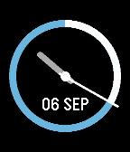
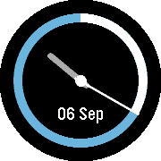
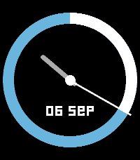
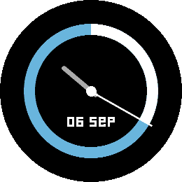

# Halo Swipe

<p>
</p>

Simple pebble watchface inspired by the OG Time 2 kickstarter videos

| Codename | Pebble name       | Watchface                                               |
|----------|-------------------|---------------------------------------------------------|
| aplite   | Pebble            |   |
| basalt   | Pebble Time       |   |
| chalk    | Pebble Time Round |    |
| diorite  | Pebble 2          |  |
| emery    | Pebble Time 2     |    |
| flint    | Pebble 2 Duo      |    |
| gabbro   | Pebble Round 2    |   |

### Currently supported

- [x] Adaptive to all supported pebble sizes
- [x] Configure the color of the background halo
- [x] Configure the color of the minute halo
- [x] Configure the color of the hands individually
- [x] Configure the health line

#### Building

- Python 3.10.x required

```bash
# Booting the emulator
pebble install --emulator flint

# Building
pebble build

# Running
pebble install
pebble install --cloudpebble 
pebble install --emulator flint --logs
```

#### Useful Links

- [Hardware information](https://developer.rebble.io/guides/tools-and-resources/hardware-information/)
- [UI Samples](https://github.com/pebble-examples/ui-patterns/)
- [Modular Architecture](https://github.com/pebble-examples/modular-app-example/blob/master/src/windows/main_window.h)
- [Best Practices](https://developer.rebble.io/guides/best-practices/modular-app-architecture/)
